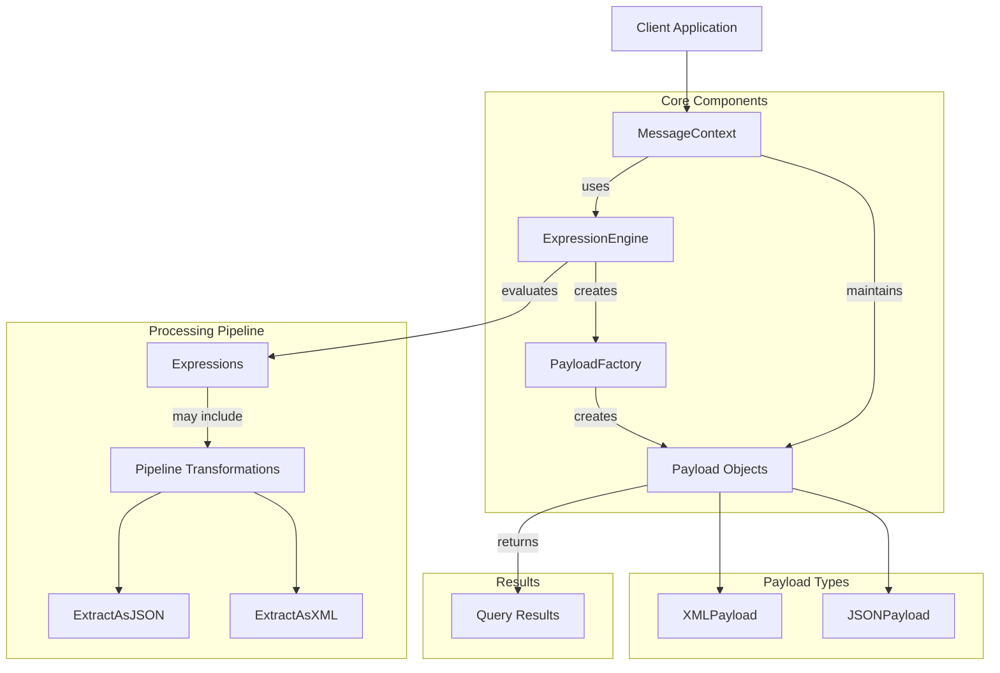
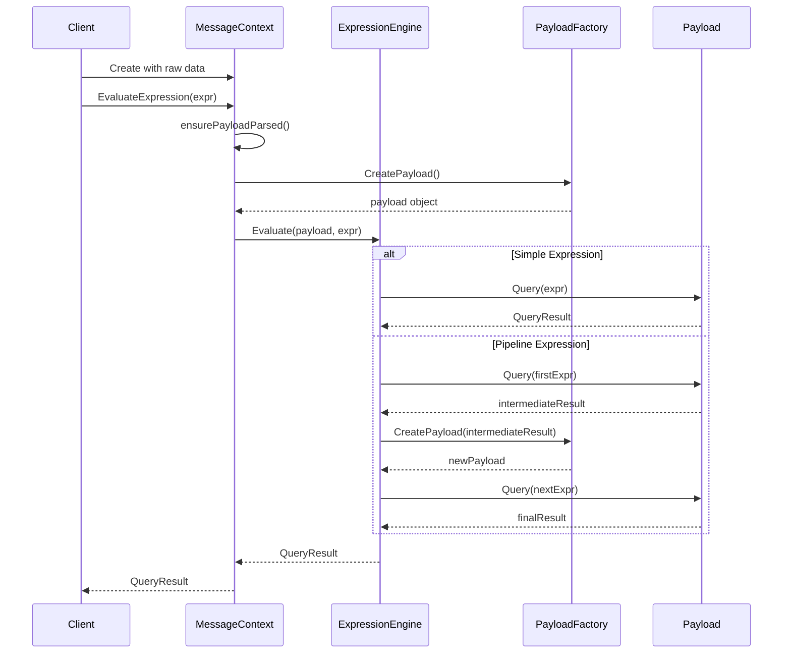

# Payload Processor

A flexible and extensible Go library for processing and transforming structured payloads (XML, JSON) using expression languages (XPath, JSONPath).

## Features

- **Multi-format support**: Process XML and JSON payloads using their native query languages
- **Pipeline processing**: Transform between formats with chainable operations
- **Lazy parsing**: Performance optimization through on-demand payload parsing
- **Type-aware**: Automatic handling of different data types (string, number, boolean, array, object)
- **Error handling**: Comprehensive error types for better debugging

## Architecture

### High-Level Overview



### Component Interactions



### Class Diagram

```mermaid
classDiagram
    class MessageContext {
        -RawPayload []byte
        -ContentType string
        -processedPayload PayloadObject
        -payloadLock sync.RWMutex
        -engine *ExpressionEngine
        -payloadFactory *PayloadFactory
        +NewMessageContext()
        +EvaluateExpression(string) QueryResult, error
        -ensurePayloadParsed() error
        +GetProcessedPayload() PayloadObject, error
    }
    
    class ExpressionEngine {
        -payloadFactory *PayloadFactory
        +NewEngine()
        +Evaluate(PayloadObject, string) QueryResult, error
        -evaluateSingleExpression(PayloadObject, string) QueryResult, error
    }
    
    class PayloadFactory {
        +NewPayloadFactory()
        +CreatePayload([]byte, string) PayloadObject, error
    }
    
    class PayloadObject {
        <<interface>>
        +GetRawBytes() []byte
        +GetContentType() string
        +Query(string) QueryResult, error
        +AsString() string, error
        +GetUnderlying() interface{}
    }
    
    class QueryResult {
        +Value interface{}
        +Type ResultType
    }
    
    class XMLPayload {
        -rawContent []byte
        -parsedDoc *xmlquery.Node
        -contentType string
        +Query(string) QueryResult, error
    }
    
    class JSONPayload {
        -rawContent []byte
        -jsonResult gjson.Result
        -contentType string
        +Query(string) QueryResult, error
    }
    
    MessageContext --> ExpressionEngine
    MessageContext --> PayloadFactory
    MessageContext --> PayloadObject
    ExpressionEngine --> PayloadFactory
    PayloadObject <|.. XMLPayload
    PayloadObject <|.. JSONPayload
    PayloadFactory --> PayloadObject
    PayloadObject --> QueryResult
```

## Usage Examples

### Processing XML Content

```go
engine := parser.NewEngine()
xmlData := []byte(`<root><user><id>123</id><name>John Doe</name></user></root>`)
xmlMsgCtx := parser.NewMessageContext(xmlData, "application/xml", engine)

// Get user name using XPath
nameResult, err := xmlMsgCtx.EvaluateExpression("xpath:/root/user/name/text()")
if err != nil {
    log.Fatalf("Error: %v", err)
}
fmt.Printf("Name: %s\n", nameResult.Value)
```

### Processing JSON Content

```go
engine := parser.NewEngine()
jsonData := []byte(`{"store":{"book":[{"title":"First Book","price":10.99}]}}`)
jsonMsgCtx := parser.NewMessageContext(jsonData, "application/json", engine)

// Get book title using JSONPath
titleResult, err := jsonMsgCtx.EvaluateExpression("jsonpath:store.book.0.title")
if err != nil {
    log.Fatalf("Error: %v", err)
}
fmt.Printf("Title: %s\n", titleResult.Value)
```

### Mixed Content Processing with Pipeline

```go
// Process XML with embedded JSON
mixedData := []byte(`<order><details><![CDATA[{"item":"laptop"}]]></details></order>`)
mixedCtx := parser.NewMessageContext(mixedData, "application/xml", engine)

// Extract JSON from XML, then query the JSON
result, err := mixedCtx.EvaluateExpression("xpath:/order/details/text() | extractAsJSON | jsonpath:item")
if err != nil {
    log.Fatalf("Error: %v", err)
}
fmt.Printf("Item: %s\n", result.Value)
```

## Key Components

1. **MessageContext**: The main entry point for working with payloads
   - Manages payload lifecycle
   - Implements lazy parsing for performance
   - Provides expression evaluation API

2. **ExpressionEngine**: Processes expressions with support for pipelines
   - Parses expression syntax and delegates to appropriate payload handler
   - Manages transformation pipelines between different formats

3. **PayloadFactory**: Creates appropriate payload handlers based on content type
   - Factory pattern implementation for extensibility
   - Supports XML and JSON with a framework for adding more formats

4. **Payload Objects**: Format-specific implementations (XMLPayload, JSONPayload)
   - Implements parsing and query capabilities for specific formats
   - Returns standardized QueryResult objects

5. **QueryResult**: Standardized format for expression results
   - Contains both value and type information
   - Supports various return types (scalar, nodeset, array, object)

## Dependencies

- github.com/antchfx/xpath: XPath expression evaluation
- github.com/antchfx/xmlquery: XML parsing and query
- github.com/tidwall/gjson: Fast JSON parsing and query

## Error Handling

The library provides specific error types for better debugging:
- ErrEvaluationFailed: Expression evaluation failures
- ErrInvalidPayloadForOperation: Content type mismatches
- ErrUnsupportedExpression: Unsupported expression syntax

## Future Enhancements

1. Support for more payload formats (YAML, CSV)
2. Additional transformation operations in the pipeline
3. Expression compilation and caching for performance
4. Custom function support in expressions
5. Schema validation integration